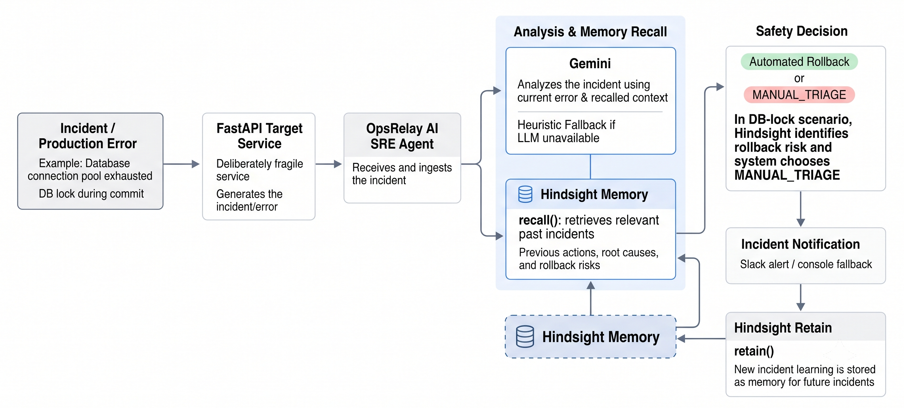
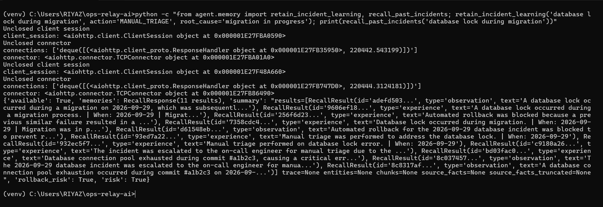
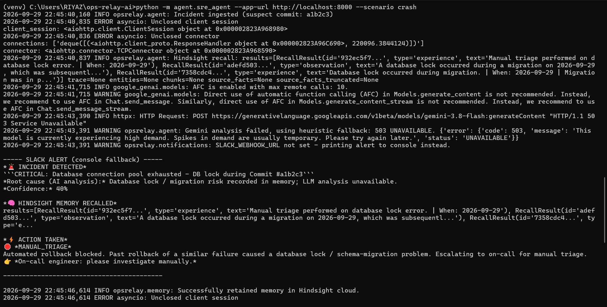
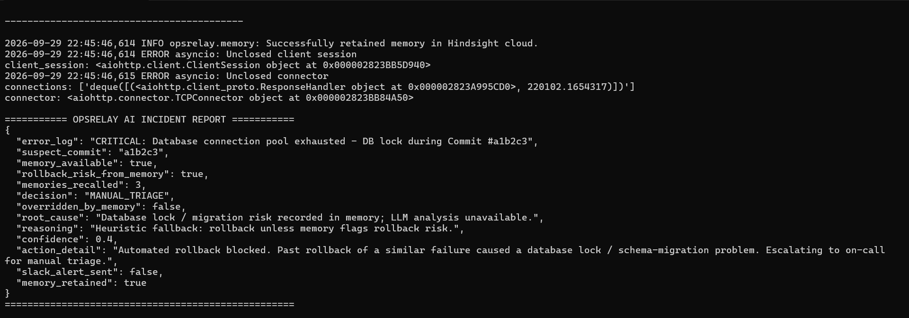

# I Kept Hindsight Between the Model and the Rollback Button

A rollback is usually treated as the safe response to a bad deployment. I built an incident agent around a less comfortable possibility: the rollback itself may be what turns a bad deploy into a long outage. In OpsRelay, Hindsight gives the agent access to what happened during earlier incidents, and a deterministic check uses that history to stop an unsafe automated action.

## The decision is bigger than the log line

OpsRelay ingests an incident, recalls related history, asks a model to choose between rollback and manual triage, applies a safety guardrail, and then takes an action. It sends the result to an on-call channel and retains the outcome for future incidents. The repository separates those responsibilities: `agent/memory.py` owns Hindsight recall and retention, `agent/sre_agent.py` coordinates the incident flow, `agent/notifications.py` builds the alert, and `app/main.py` defines the service errors the agent handles.

The important design choice is that Hindsight is not just a paragraph appended to a prompt. The recalled history also becomes a machine-readable risk signal. If an earlier rollback was associated with a database lock or a schema migration, the agent can prevent the rollback even when the model recommends it.

Here is the path through the system. Hindsight supplies context before the decision and receives the outcome afterward; the policy check sits between analysis and any production action.



*OpsRelay AI architecture, with Hindsight recall before the safety decision and retention after notification.*

That distinction matters. A language model can help interpret an unfamiliar incident, but I do not want a model response to be the only thing standing between production and a potentially damaging action. I use the model to analyze; I use code to enforce the policy.

## Why I put memory in the action path

Many incident systems begin with a rule like “new version crashes, so revert the deployment.” That rule is useful until the failure is entangled with persistent state. A deployment may have run a schema migration or left transactions in flight. Reverting application code does not reverse those effects. It can leave old code talking to a new schema, hold locks longer, or exhaust a connection pool.

Those relationships are often learned the hard way, during an incident. If that knowledge lives only in a postmortem, a runbook, or someone’s memory, the automation is likely to repeat the same mistake. I wanted the system to retrieve incident outcomes at the point where it is about to act.

Hindsight gives OpsRelay a persistent incident memory through its `recall` and `retain` operations. The agent queries the `sre_incidents` bank with the current error and stores a compact record of the error, action, and root cause after handling it:

```python
results = client.recall(
    query=f"How did we handle this error: {error_log}?",
    bank_id=BANK_ID,
)
```

The memory layer keeps those calls behind `recall_past_incidents` and `retain_incident_learning`. That boundary means the orchestrator works with a consistent result shape and does not need to know whether the Hindsight client is configured. It also gives the application one place to handle API errors and local development behavior.

For a completed incident, the retained record includes an action and cause, not just the original log. That is deliberate. “Database connection pool exhausted” is an observation. “Rolling back across an in-flight schema migration caused a lock and cascading pool failure” is the operational lesson that can change the next decision.

The write side is deliberately small: one durable record that can be recalled alongside the next incident.

```python
from datetime import datetime, timezone

record = (
    f"Timestamp: {datetime.now(timezone.utc).isoformat()} | Error: {error_log} | "
    f"Action: {final_action} | Cause: {root_cause}"
)
client.retain(content=record, bank_id=BANK_ID)
```

I also exercised the memory adapter directly: retain an incident outcome, then recall against a database-lock query. The returned Hindsight response included 11 results, with `available`, `rollback_risk`, and `risk` all true.



*Direct Hindsight integration run: incident retention followed by cloud recall and a positive rollback-risk signal.*

## Memory informs the model; policy constrains it

The incident coordinator sends the current log, suspect commit, recalled memories, and risk flag to the model. When the model is unavailable, a deterministic heuristic still chooses a path. Then the coordinator validates the decision and applies the memory guardrail:

```python
decision = analysis.decision.strip().upper()
if decision not in (DECISION_ROLLBACK, DECISION_MANUAL_TRIAGE):
    decision = DECISION_MANUAL_TRIAGE

if decision == DECISION_ROLLBACK and recall["rollback_risk"]:
    decision = DECISION_MANUAL_TRIAGE
    overridden = True
```

This is a small block of code with a large responsibility. The model’s output is not trusted as an executable command. Unknown output fails toward manual triage, and a recognized rollback-risk signal can override a valid rollback recommendation. That makes the safety property visible in ordinary application code, reviewable without interpreting a prompt, and available even when the model suggests otherwise.

The memory layer currently derives that risk signal by checking recalled content for terms such as “database lock,” “lock timeout,” and “migration in progress.” That gives the rule an explicit, inspectable shape. In a production implementation, I would keep the same boundary while making the risk evidence more structured: retain incident type and action outcome as fields, require a clear match threshold, and preserve the underlying memories so an operator can see why the guardrail fired. The policy should not silently turn every vaguely similar incident into a block.

I also keep the fallback behavior explicit. If the Hindsight client cannot be initialized or recall fails, the memory layer uses its local store and reports that remote memory was unavailable. An incident must still be handled when a dependency is down. At the same time, the report and alert should make the missing historical context obvious; “no risk found” and “could not check” are different states. That distinction is important enough to carry through the API rather than bury in a log message.

## Walking through the failure

The repository’s crash scenario produces a database connection-pool exhaustion error that mentions a database lock and a commit. A previous incident has been retained with the outcome that rolling back across a schema migration worsened the outage. When the next incident arrives, the flow looks like this:

1. OpsRelay extracts the suspect commit from the log.
2. It asks Hindsight for related incidents in `sre_incidents`.
3. The coordinator asks the model to analyze the current error and recalled outcome; if that call fails, it uses the deterministic heuristic.
4. The coordinator checks the decision against the risk flag before dispatching any rollback.
5. If the history indicates rollback risk, OpsRelay escalates to manual triage, alerts the on-call engineer, and retains the new outcome.

The guardrail is applied before `trigger_rollback`, so the blocked path does not dispatch the GitHub Actions workflow. This ordering is the operational property I care about. A log entry that says “rollback blocked” after the workflow has already started would not be a safety mechanism.

In the captured run, Hindsight recall succeeded and returned relevant database-lock and migration history. Gemini then returned a temporary HTTP 503. OpsRelay used its heuristic fallback, which read the rollback-risk flag and selected `MANUAL_TRIAGE`. Because the heuristic chose manual triage directly, `overridden_by_memory` is `false`: the system did not replace a Gemini rollback recommendation. It still retained the incident outcome in Hindsight after handling it.



*Captured incident flow: Hindsight recall worked; after Gemini returned HTTP 503, the heuristic used the recalled risk to choose manual triage.*

The final report makes those stages visible in separate fields, including three memories recalled, the risk flag, the decision, and successful retention:



*Final incident report showing Hindsight-informed safety handling and the heuristic fallback outcome.*

The same pipeline handles a memory-leak error. If history does not indicate rollback risk and the model identifies a bad deployment, the agent can request a rollback. If model analysis fails, the heuristic still chooses a decision based on the available risk signal. If the GitHub dispatch fails, the coordinator escalates instead of reporting success. Each branch has an explicit outcome that can be included in the incident report and Slack message.

The alert is part of the design, not an afterthought. `notifications.py` includes the incident, root cause, memory summary, final action, and whether Hindsight overrode the recommendation. An operator needs to know not only that the system chose manual triage, but also that it did so because a previous rollback had a relevant failure mode. That makes the automated decision inspectable while the incident is still live.

## What I learned building the boundary

**1. Store outcomes, not just symptoms.** The error text tells me what broke. The action and root cause tell me whether the attempted fix helped. Memory is much more useful when it captures that complete relationship.

**2. Keep safety rules outside the prompt.** Prompt instructions help the model reason consistently, but the final check belongs in code. A policy that can block an action should be deterministic, easy to review, and applied immediately before execution.

**3. Treat unavailable memory as its own state.** A failed recall is not evidence that no relevant incident exists. The system should continue operating, but its report should distinguish degraded context from a clean search.

**4. Make the override legible to the human.** Manual triage without an explanation creates confusion and alert fatigue. Include the recalled reason, the action that was blocked, and the escalation path in the report.

**5. Test the boundary with the failure you fear.** The useful scenario is not just “the agent can roll back.” It is “the model recommends rollback, history flags risk, and no rollback request is sent.” That is the behavior worth proving before connecting the workflow to a real deployment system.

## Memory is useful when it changes the next action

I use [Hindsight on GitHub](https://github.com/vectorize-io/hindsight) and the [Hindsight documentation](https://hindsight.vectorize.io/) as the persistent memory layer behind this flow. The broader idea of [agent memory from Vectorize](https://vectorize.io/what-is-agent-memory) is useful here for a practical reason: an incident agent needs access to outcomes that are not present in the current log or prompt.

OpsRelay’s central decision is intentionally narrow. Hindsight does not take over incident response, and the model does not get unrestricted authority to mutate production. The system retrieves operational experience, uses it to constrain one risky action, and explains the result to a human. That is a small enough boundary to reason about—and a meaningful way for an incident system to learn from the last outage before repeating it.
